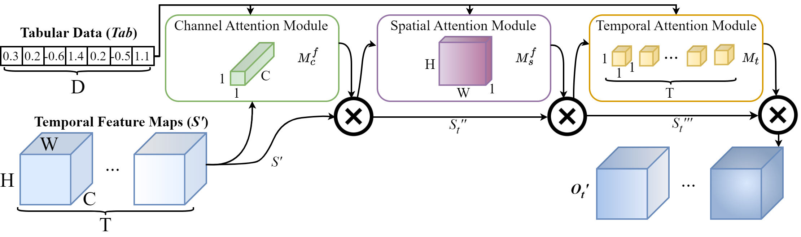
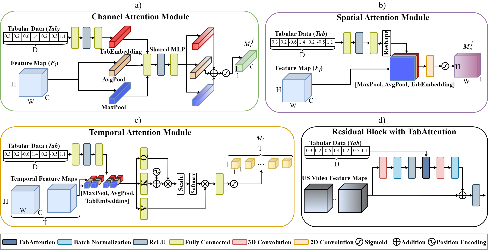

# TabAttention: Learning Attention Conditionally on Tabular Data

This is the official code for "TabAttention: Learning Attention Conditionally on Tabular Data" presented at the 26th International Conference on Medical Image Computing and Computer Assisted Intervention (MICCAI) 2023.
###  | [Paper](https://arxiv.org/pdf/2310.18129.pdf) |

### Abstract
Medical data analysis often combines both imaging and tabular data processing using machine learning algorithms. While previous studies have investigated the impact of attention mechanisms on deep learning models, few have explored integrating attention modules and tabular data. In this paper, we introduce TabAttention, a novel module that enhances the performance of Convolutional Neural Networks (CNNs) with an attention mechanism that is trained conditionally on tabular data. Specifically, we extend the Convolutional Block Attention Module to 3D by adding a Temporal Attention Module that uses multi-head self-attention to learn attention maps. Furthermore, we enhance all attention modules by integrating tabular data embeddings. Our approach is demonstrated on the fetal birth weight (FBW) estimation task, using 92 fetal abdominal ultrasound video scans and fetal biometry measurements. Our results indicate that TabAttention outperforms clinicians and existing methods that rely on tabular and/or imaging data for FBW prediction. This novel approach has the potential to improve computer-aided diagnosis in various clinical workflows where imaging and tabular data are combined.

### TabAttention layer
TabAttention can be seamlessly integrated within any CNN as an intermediate layer. Basic usage: 
```python
from src.models.tabattention import TabAttention

x_input = torch.randn(1, 64, 16, 16, 4)  # B,C,H,W,F
tab_input = torch.randn(1, 1, 6) # 6 tabular features
input_dim = (64, 16, 16, 4)  # C,H,W,F

tabattention = TabAttention(input_dim=input_dim, tab_dim=6)
tabattention(x_input, tab_input)
```



### Repository details


In this repository we provide the code for using TabAttention integrated with 3D ResNet-18. We provide the training
script with validation code in _train\_video.py_ and data loader with data augmentations in _video\_data\_loader.py_.
The code used for generating results for ML-based methods and Clinicians are presented in _ml\_methods.py_ and
_clinicians.py_ respectively. All SOTA methods and models that we used during experiments are available in
src/models/... files. We provide pretrained weights of 3D ResNet-18 with TabAttention [here](https://www.dropbox.com/s/cdswqlhew638ebd/TabAttention.pt?dl=0).


To install dependencies:

```shell
pip install -r requirements.txt
```


To run the training code with default parameters, prepare the dataloader and run:

```shell
cd src
python train_video.py
```

### Citation
```Bibtex
@inproceedings{grzeszczyk2023tabattention,
  title={TabAttention: Learning Attention Conditionally on Tabular Data},
  author={Grzeszczyk, Michal K and P{\l}otka, Szymon and Rebizant, Beata and Kosi{\'n}ska-Kaczy{\'n}ska, Katarzyna and Lipa, Micha{\l} and Brawura-Biskupski-Samaha, Robert and Korzeniowski, Przemys{\l}aw and Trzci{\'n}ski, Tomasz and Sitek, Arkadiusz},
  booktitle={International Conference on Medical Image Computing and Computer-Assisted Intervention},
  pages={347--357},
  year={2023},
  organization={Springer}
}
```